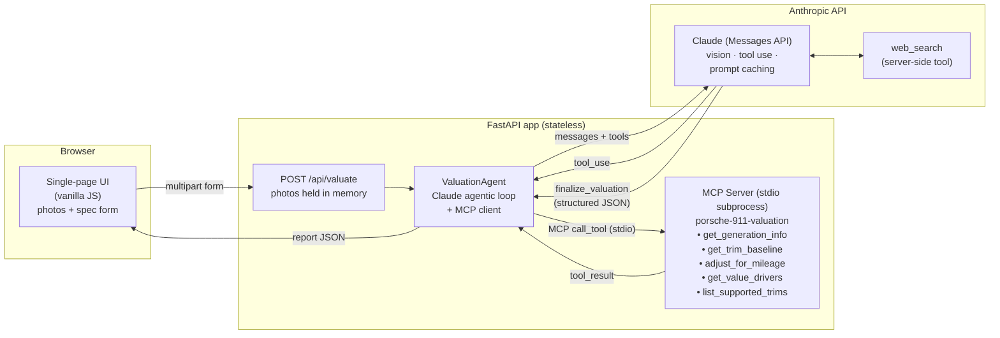

# Porsche 911 Valuator

[](https://render.com/deploy?repo=https://github.com/gwest-enterprisemaps/GWest-Porsche-911-Valuator)

An AI-powered market valuation app for Porsche 911s. Enter your car's specs, mileage, and history, drop in a few photos, and get a structured valuation report backed by generation-specific domain knowledge and live market comps.

Built to showcase the **Claude API** and the **Model Context Protocol (MCP)** end to end: the app is simultaneously an MCP *server* (Porsche domain tools) and an MCP *client* (the Claude agent that consumes them).

**Stateless by design** — photos and specs live only in request memory. Nothing is written to disk or a database.

## Architecture



**Request flow:** the browser posts specs + photos → FastAPI base64-encodes photos in memory → the agent runs a multi-turn loop with Claude, which (1) grounds itself via the MCP tools, (2) inspects the photos with vision, (3) pulls live comps via server-side web search, then (4) submits the final report through a JSON-schema'd tool. The structured report renders in the browser.

## Claude platform elements used

| Element | Where | What it does |
|---|---|---|
| **Messages API** | `app/agent.py` | Multi-turn agentic loop via the `anthropic` SDK (`AsyncAnthropic`) |
| **Vision** | `app/agent.py` | User photos passed as in-memory base64 image blocks; Claude grades condition, spots mods/damage, verifies trim |
| **Tool use** | `app/agent.py` | Claude autonomously decides which tools to call and in what order |
| **MCP server** | `mcp_server/server.py` | `FastMCP` server exposing 911 domain tools over stdio — also usable directly from Claude Desktop |
| **MCP client** | `app/agent.py` | `mcp` SDK `ClientSession` discovers the server's tools and bridges them into the Claude tool-use loop |
| **Server-side web search** | `app/agent.py` | Anthropic-hosted `web_search_20250305` tool fetches recent comparable sales — no scraping code needed |
| **Structured output** | `app/agent.py` | Final answer is forced through a `finalize_valuation` tool with a strict JSON schema — the UI renders it directly |
| **Prompt caching** | `app/agent.py` | `cache_control: ephemeral` on the system prompt and tool definitions cuts cost/latency across loop turns |
| **System prompts** | `app/agent.py` | A methodology prompt that sequences MCP grounding → photo analysis → live comps → reconciliation |

## Project layout

```
porsche-911-valuator/
├── app/
│   ├── main.py          # FastAPI app: routes, upload validation, lifespan
│   └── agent.py         # ValuationAgent: Claude loop + MCP client bridge
├── mcp_server/
│   ├── server.py        # FastMCP server (stdio) — 5 valuation tools
│   └── data.py          # 911 generations, baselines, value drivers
├── static/              # Single-page frontend (no build step)
│   ├── index.html
│   ├── app.js
│   └── style.css
├── docs/
│   └── architecture.md  # Deeper architecture notes
├── requirements.txt
├── Dockerfile
└── .env.example
```

## Run locally

Requires Python 3.11+ and an [Anthropic API key](https://console.anthropic.com).

```bash
git clone <this-repo> && cd porsche-911-valuator
python -m venv .venv && source .venv/bin/activate
pip install -r requirements.txt

cp .env.example .env       # add your ANTHROPIC_API_KEY

uvicorn app.main:app --reload
```

Open http://localhost:8000. The MCP server is spawned automatically as a subprocess — no separate process to manage.

## Deploy to a simple web server

**One-click:** hit the "Deploy to Render" button above — Render reads `render.yaml`, builds the Dockerfile, prompts for your `ANTHROPIC_API_KEY`, and gives you a public HTTPS URL. Every push to `main` auto-redeploys.

Or any box that runs Python:

```bash
uvicorn app.main:app --host 0.0.0.0 --port 8000
```

Or with Docker:

```bash
docker build -t 911-valuator .
docker run -p 8000:8000 -e ANTHROPIC_API_KEY=sk-ant-... 911-valuator
```

Because the app is stateless, it needs no database or volume — put it behind nginx/Caddy for TLS and you're done. It also scales horizontally with zero coordination.

## Use the MCP server on its own

The valuation tools work in any MCP host (e.g., Claude Desktop):

```json
{
  "mcpServers": {
    "porsche-911-valuation": {
      "command": "python",
      "args": ["-m", "mcp_server.server"],
      "cwd": "/path/to/porsche-911-valuator"
    }
  }
}
```

## Notes & limitations

- Baseline values in `mcp_server/data.py` are illustrative anchors; the agent is instructed to trust live web comps over them.
- Estimates are informational only — not an appraisal or offer.
- Photo uploads are capped at 5 images / 5 MB each and are never persisted.
- `/api/valuate` is rate-limited per client IP (`RATE_LIMIT`, default `5/minute;30/day`) to protect your API spend. The limiter is in-memory, matching the app's stateless design; if you ever run multiple replicas, point slowapi at Redis.
